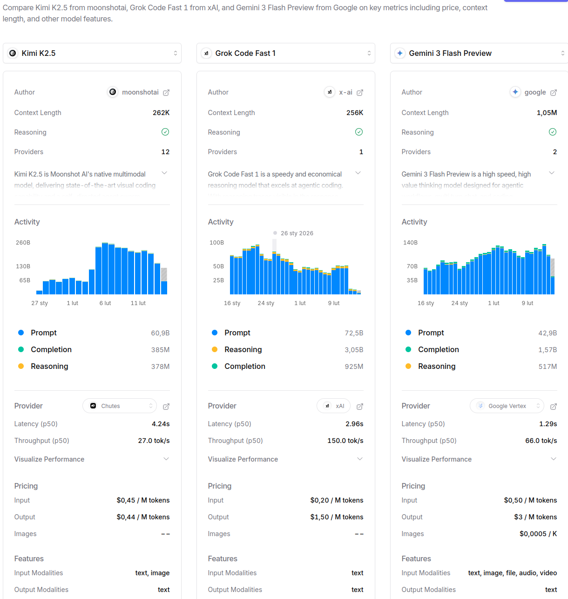

# ats-benchmark

Benchmark narzędzi kompresji kodu dla kontekstu LLM — porównanie **code2logic**, **nfo** i baseline (surowy kod) z użyciem LiteLLM + OpenRouter.

## Cel

Głównym wyzwaniem w używaniu LLM do naprawy projektów jest dostarczenie precyzyjnego kontekstu kodu i przepływu danych bez przeciążania okna kontekstowego. Ten benchmark mierzy:

- **Kompresję** — ile tokenów oszczędza każde narzędzie vs surowy kod
- **Jakość** — jak dobrze LLM rozumie skompresowany kontekst (analiza kodu)
- **Szybkość** — czas analizy + czas odpowiedzi LLM

## Struktura projektu

```
ats-benchmark/
├── .env.example              # Konfiguracja OpenRouter (skopiuj do .env)
├── Makefile                  # make all / make benchmark-all / make results
├── docker-compose.yml        # Docker services dla każdego benchmarku
├── analyze_results.py        # Porównanie wyników
├── sample-app/               # Przykładowa aplikacja e-commerce (~300 LOC)
│   ├── models.py             # Modele: Product, Order, Customer, Cart
│   ├── services.py           # Logika: Catalog, Cart, Payment, Analytics
│   └── main.py               # Entry point z przykładowym workflow
└── benchmarks/
    ├── common.py             # Wspólne utilities (LLM call, metryki)
    ├── code2logic/           # Benchmark: AST + function logic compression
    ├── nfo/                  # Benchmark: data flow + runtime logging
    └── baseline/             # Benchmark: surowy kod (bez kompresji)
```

## Szybki start

```bash
# 1. Konfiguracja
cp .env.example .env
# Edytuj .env — ustaw OPENROUTER_API_KEY i MODEL_ID

# 2. Docker (zalecane)
make all                    # Build + benchmark + results

# 3. Lub lokalnie (wymaga pip install)
pip install litellm code2logic nfo
make local-all
```

## Komendy Makefile

| Komenda                  | Opis                                    |
|--------------------------|-----------------------------------------|
| `make all`               | Build Docker + uruchom benchmarki + wyniki |
| `make build`             | Zbuduj obrazy Docker                    |
| `make benchmark-all`     | Uruchom wszystkie benchmarki            |
| `make benchmark-code2logic` | Tylko code2logic                     |
| `make benchmark-nfo`     | Tylko nfo                               |
| `make benchmark-baseline`| Tylko baseline (surowy kod)             |
| `make results`           | Pokaż porównanie wyników                |
| `make clean`             | Wyczyść wyniki i obrazy Docker          |
| `make local-all`         | Uruchom lokalnie (bez Docker)           |

## Porównanie narzędzi

| Narzędzie          | Funkcje kluczowe                          | Zalety dla LLM kontekstu                  | Wady                              | Języki wsparcia          | Integracja z ATS/nfo |
|--------------------|-------------------------------------------|-------------------------------------------|-----------------------------------|--------------------------|----------------------|
| code2logic (wronai) | Ekstrakcja logiki/AST z kodu do struktury | Zawężony kontekst bez surowego kodu, szybka analiza  [github](https://github.com/tongjingqi/code2logic) | Brak natywnego data flow         | Python głównie          | Bazowe (Twoje ATS)  |
| nfo (wronai)       | Opis przepływu danych, struktura projektu | Dodaje grafy danych do AST, edge computing  [github](https://github.com/wronai) | Potrzeba integracji z ATS        | Python, edge            | Rozszerzenie ATS    |
| callgraph-cli      | Grafy wywołań funkcji, relacje kodu       | CLI kopiuje kontekst do schowka dla LLM, precyzyjny flow  [github](https://github.com/vmotta8/callgraph-cli) | Mniej data flow niż call graph   | Multi (Python, JS+)     | Łatwa via CLI       |
| tree-sitter + py2ast | Parsowanie AST, serializacja do tekstu    | Hierarchiczne struktury dla RAG/LLM, niskie zużycie tokenów  [arxiv](https://arxiv.org/html/2507.00352v1) | Wymaga własnego grafu data flow  | 50+ języków             | Wysoka (parsery)    |
| JavaDataFlow       | Grafy data flow z pól/parametrów          | Precyzyjny tracking danych w metodach  [github](https://github.com/daanvdh/JavaDataFlow) | Tylko Java, statyczna analiza    | Java                    | Średnia (adaptacja) |
| semanticflowgraph  | Semantyczne grafy flow dla DS             | Wizualizacja + enrich z raw graph  [github](https://github.com/IBM/semanticflowgraph) | Skupione na data science         | Python/R                | Niska (DS focus)    |

## License

Apache License 2.0 - see [LICENSE](LICENSE) for details.

## Author

Created by **Tom Sapletta** - [tom@sapletta.com](mailto:tom@sapletta.com)
