## Overview

- **Project**: /home/tom/github/semcod/ats-benchmark
- **Primary Language**: python
- **Languages**: python: 33, shell: 1
- **Analysis Mode**: static
- **Total Functions**: 126
- **Total Classes**: 18
- **Modules**: 34
- **Entry Points**: 72

### sample-app.services
- **Functions**: 27
- **Classes**: 5
- **File**: `services.py`

### benchmarks.common
- **Functions**: 17
- **Classes**: 2
- **File**: `common.py`

### sample-app.models
- **Functions**: 11
- **Classes**: 8
- **File**: `models.py`

### benchmarks.repair.baseline.fixes.app__log_flow_parser
- **Functions**: 8
- **Classes**: 1
- **File**: `app__log_flow_parser.py`

### analyze_results
- **Functions**: 7
- **File**: `analyze_results.py`

### benchmarks.repair.repair_pipeline
- **Functions**: 7
- **File**: `repair_pipeline.py`

### benchmarks.radon.benchmark
- **Functions**: 7
- **File**: `benchmark.py`

### benchmarks.config
- **Functions**: 6
- **File**: `config.py`

### benchmarks.astgrep.benchmark
- **Functions**: 6
- **File**: `benchmark.py`

### benchmarks.treesitter.benchmark
- **Functions**: 5
- **File**: `benchmark.py`

### benchmarks.callgraph.benchmark
- **Functions**: 5
- **File**: `benchmark.py`

### benchmarks.bandit.benchmark
- **Functions**: 5
- **File**: `benchmark.py`

### benchmarks.source
- **Functions**: 3
- **File**: `source.py`

### benchmarks.nfo.benchmark
- **Functions**: 3
- **File**: `benchmark.py`

### sample-app.main
- **Functions**: 3
- **File**: `main.py`

### benchmarks.models
- **Functions**: 2
- **Classes**: 2
- **File**: `models.py`

### benchmarks.llm
- **Functions**: 1
- **File**: `llm.py`

### benchmarks.code2logic.benchmark
- **Functions**: 1
- **File**: `benchmark.py`

### benchmarks.baseline.benchmark
- **Functions**: 1
- **File**: `benchmark.py`

### benchmarks.env
- **Functions**: 1
- **File**: `env.py`

## Key Entry Points

Main execution flows into the system:

### benchmarks.code2logic.benchmark.run_benchmark
- **Calls**: time.time, benchmarks.config.get_target_project, benchmarks.source.count_raw_code_chars, time.time, ANALYSIS_USER_PROMPT_TEMPLATE.format, benchmarks.llm.call_llm, benchmarks.common.save_llm_artifacts, BenchmarkResult

### benchmarks.repair.repair_pipeline._context_nfo
> Generate data-flow context using nfo-style analysis.
- **Calls**: sorted, lines.append, imports_map.items, None.join, project_path.rglob, any, content.splitlines, lines.append

### benchmarks.common.check_llm_connection
> Test LLM connection with a simple prompt and return diagnostic info.
- **Calls**: print, benchmarks.common.get_model, print, os.getenv, print, time.time, litellm.completion, print

### benchmarks.nfo.benchmark.run_benchmark
- **Calls**: time.time, benchmarks.config.get_target_project, benchmarks.source.count_raw_code_chars, time.time, benchmarks.nfo.benchmark._analyze_with_nfo, benchmarks.nfo.benchmark._generate_runtime_logs, ANALYSIS_USER_PROMPT_TEMPLATE.format, benchmarks.llm.call_llm

### sample-app.main.run_sample_workflow
- **Calls**: sample-app.main.setup_catalog, PaymentProcessor, OrderService, AnalyticsService, sample-app.main.create_sample_customer, ShoppingCart, cart.add_item, cart.add_item

### benchmarks.treesitter.benchmark.run_benchmark
- **Calls**: time.time, benchmarks.config.get_target_project, benchmarks.source.count_raw_code_chars, time.time, benchmarks.treesitter.benchmark._build_treesitter_context, ANALYSIS_USER_PROMPT_TEMPLATE.format, benchmarks.llm.call_llm, benchmarks.common.save_llm_artifacts

### benchmarks.astgrep.benchmark.run_benchmark
- **Calls**: time.time, benchmarks.config.get_target_project, benchmarks.source.count_raw_code_chars, time.time, ANALYSIS_USER_PROMPT_TEMPLATE.format, benchmarks.llm.call_llm, benchmarks.common.save_llm_artifacts, BenchmarkResult

### benchmarks.bandit.benchmark.run_benchmark
- **Calls**: time.time, benchmarks.config.get_target_project, benchmarks.source.count_raw_code_chars, time.time, ANALYSIS_USER_PROMPT_TEMPLATE.format, benchmarks.llm.call_llm, benchmarks.common.save_llm_artifacts, BenchmarkResult

### benchmarks.radon.benchmark.run_benchmark
- **Calls**: time.time, benchmarks.config.get_target_project, benchmarks.source.count_raw_code_chars, time.time, ANALYSIS_USER_PROMPT_TEMPLATE.format, benchmarks.llm.call_llm, benchmarks.common.save_llm_artifacts, BenchmarkResult

### benchmarks.repair.baseline.fixes.app__log_flow_parser.LogFlowParser._build_flow_graphs
> Build directed flow graphs for each trace.

Args:
    grouped_logs: Logs grouped by trace_id
    
Returns:
    Graph representation with nodes (servic
- **Calls**: grouped_logs.items, set, enumerate, nodes.add, None.get, None.get, sorted, len

### benchmarks.baseline.benchmark.run_benchmark
- **Calls**: time.time, benchmarks.config.get_target_project, benchmarks.source.count_raw_code_chars, time.time, benchmarks.source.read_all_source_files, ANALYSIS_USER_PROMPT_TEMPLATE.format, benchmarks.llm.call_llm, benchmarks.common.save_llm_artifacts

### benchmarks.common.read_all_source_files
> Read all source files from a project directory.
- **Calls**: sorted, None.join, app_path.rglob, any, src_file.read_text, src_file.relative_to, sources.append, len

### benchmarks.common.call_llm
> Call LLM via litellm with OpenRouter and return response + metrics.
- **Calls**: benchmarks.common.get_model, benchmarks.common.get_temperature, os.getenv, messages.append, time.time, benchmarks.common.get_max_tokens, messages.append, print

### benchmarks.repair.baseline.fixes.app__log_flow_parser.LogFlowParser.get_global_statistics
> Get global statistics across all traces.
- **Calls**: len, sum, set, self.grouped_logs.values, sorted, len, all_services.add, list

### sample-app.services.OrderService.create_order
- **Calls**: Order, self._payment.process_payment, order.confirm, cart.customer.earn_points, logger.info, cart.clear, reserved.append, item.product.reserve

### benchmarks.env.load_env
> Load .env from workspace root (works in Docker and locally).
- **Calls**: Path, candidate.exists, None.splitlines, line.strip, line.partition, Path, candidate.read_text, line.startswith

### benchmarks.common._load_env
> Load .env from workspace root (works in Docker and locally).
- **Calls**: Path, candidate.exists, None.splitlines, line.strip, line.partition, Path, candidate.read_text, line.startswith

### benchmarks.common.save_result
> Save benchmark result to JSON file.
- **Calls**: output_dir.mkdir, result.to_dict, output_file.write_text, print, print, print, print, print

### benchmarks.repair.repair_pipeline._context_code2logic
> Generate compressed context using code2logic.
- **Calls**: analyze_project, None.generate, None.generate, str, CompactGenerator, FunctionLogicGenerator, benchmarks.source.read_all_source_files

### benchmarks.repair.repair_pipeline.run_all_repairs
> Run repair with all tools and save results.
- **Calls**: print, print, print, Path, benchmarks.repair.repair_pipeline.run_repair, benchmarks.common.save_repair_result, print

### benchmarks.common.count_raw_code_chars
> Count total characters in all source files.
- **Calls**: app_path.rglob, src_file.is_file, src_file.suffix.lower, any, len, src_file.read_text, part.startswith

### analyze_results.main
- **Calls**: analyze_results.load_results, analyze_results.print_comparison_table, analyze_results.filter_repairs_for_benchmark_targets, analyze_results.print_repair_table, analyze_results.load_repair_results, analyze_results.save_summary_json

### benchmarks.repair.baseline.fixes.app__log_flow_parser.LogFlowParser.group_by_trace_id
> Group logs by trace_id and sort by timestamp.

Args:
    logs: List of log entries
    
Returns:
    Grouped logs sorted chronologically within each t
- **Calls**: defaultdict, dict, log.get, None.sort, None.append, x.get

### benchmarks.repair.baseline.fixes.app__log_flow_parser.LogFlowParser.compress_to_llm_format
> Compress flow graph to compact LLM-friendly string format.

Format: [trace_id]:ServiceA->ServiceB->ServiceC(logs:N,dur:Xms)

Args:
    trace_id: Speci
- **Calls**: sorted, None.join, self._compress_single_trace, self.flow_graphs.items, self._compress_single_trace, results.append

### benchmarks.repair.baseline.fixes.app__log_flow_parser.LogFlowParser._compress_single_trace
> Compress single trace to compact format.
- **Calls**: None.join, path.append, meta_parts.append, compact_path.append, None.join

### benchmarks.callgraph.benchmark._collect_priority_nodes
- **Calls**: benchmarks.callgraph.benchmark._collect_entry_point_names, benchmarks.callgraph.benchmark._add_connected_priority_nodes, benchmarks.callgraph.benchmark._sort_and_limit_priority_nodes, benchmarks.callgraph.benchmark._rank_nodes_by_degree, priority_nodes.update

### sample-app.services.ProductCatalog.search
- **Calls**: query.lower, self._products.values, p.name.lower, p.description.lower, results.append

### sample-app.services.PaymentProcessor.process_payment
- **Calls**: self._processors.get, logger.info, processor, logger.info, logger.error

### sample-app.services.AnalyticsService.revenue_summary
- **Calls**: self._order_service._orders.values, len, sum, sum, len

### benchmarks.models.RepairResult.to_dict
- **Calls**: asdict, None.items, len

## Process Flows

Key execution flows identified:

### Flow 1: run_benchmark
```
run_benchmark [benchmarks.code2logic.benchmark]
  └─ →> get_target_project
      └─> get_sample_app_path
  └─ →> count_raw_code_chars
      └─> _is_ignored_path
```

### Flow 2: _context_nfo
```
_context_nfo [benchmarks.repair.repair_pipeline]
```

### Flow 3: check_llm_connection
```
check_llm_connection [benchmarks.common]
  └─> get_model
```

### Flow 4: run_sample_workflow
```
run_sample_workflow [sample-app.main]
  └─> setup_catalog
  └─> create_sample_customer
```

### Flow 5: _build_flow_graphs
```
_build_flow_graphs [benchmarks.repair.baseline.fixes.app__log_flow_parser.LogFlowParser]
```

### Flow 6: read_all_source_files
```
read_all_source_files [benchmarks.common]
```

### Flow 7: call_llm
```
call_llm [benchmarks.common]
  └─> get_model
  └─> get_temperature
```

### Flow 8: get_global_statistics
```
get_global_statistics [benchmarks.repair.baseline.fixes.app__log_flow_parser.LogFlowParser]
```

### Flow 9: create_order
```
create_order [sample-app.services.OrderService]
```

### Flow 10: load_env
```
load_env [benchmarks.env]
```

### sample-app.services.ShoppingCart
> Shopping cart with validation and discount support.
- **Methods**: 10
- **Key Methods**: sample-app.services.ShoppingCart.__init__, sample-app.services.ShoppingCart.add_item, sample-app.services.ShoppingCart.remove_item, sample-app.services.ShoppingCart.update_quantity, sample-app.services.ShoppingCart.apply_discount, sample-app.services.ShoppingCart.items, sample-app.services.ShoppingCart.subtotal, sample-app.services.ShoppingCart.total, sample-app.services.ShoppingCart.item_count, sample-app.services.ShoppingCart.clear

### benchmarks.repair.baseline.fixes.app__log_flow_parser.LogFlowParser
> Parser for log data flow analysis.

Groups logs by trace_id, builds service interaction graphs,
and 
- **Methods**: 8
- **Key Methods**: benchmarks.repair.baseline.fixes.app__log_flow_parser.LogFlowParser.__init__, benchmarks.repair.baseline.fixes.app__log_flow_parser.LogFlowParser.parse_logs, benchmarks.repair.baseline.fixes.app__log_flow_parser.LogFlowParser.group_by_trace_id, benchmarks.repair.baseline.fixes.app__log_flow_parser.LogFlowParser._build_flow_graphs, benchmarks.repair.baseline.fixes.app__log_flow_parser.LogFlowParser.compress_to_llm_format, benchmarks.repair.baseline.fixes.app__log_flow_parser.LogFlowParser._compress_single_trace, benchmarks.repair.baseline.fixes.app__log_flow_parser.LogFlowParser.get_trace_statistics, benchmarks.repair.baseline.fixes.app__log_flow_parser.LogFlowParser.get_global_statistics

### sample-app.services.ProductCatalog
> Manages product inventory and search.
- **Methods**: 6
- **Key Methods**: sample-app.services.ProductCatalog.__init__, sample-app.services.ProductCatalog.add_product, sample-app.services.ProductCatalog.get_product, sample-app.services.ProductCatalog.search, sample-app.services.ProductCatalog.low_stock_products, sample-app.services.ProductCatalog.restock

### sample-app.services.OrderService
> Orchestrates order creation and lifecycle.
- **Methods**: 6
- **Key Methods**: sample-app.services.OrderService.__init__, sample-app.services.OrderService.create_order, sample-app.services.OrderService.get_order, sample-app.services.OrderService.cancel_order, sample-app.services.OrderService.get_customer_orders, sample-app.services.OrderService.get_orders_by_status

### sample-app.services.PaymentProcessor
> Handles payment processing with multiple methods.
- **Methods**: 5
- **Key Methods**: sample-app.services.PaymentProcessor.__init__, sample-app.services.PaymentProcessor.process_payment, sample-app.services.PaymentProcessor._process_credit_card, sample-app.services.PaymentProcessor._process_paypal, sample-app.services.PaymentProcessor._process_bank_transfer

### sample-app.services.AnalyticsService
> Provides business analytics and reporting.
- **Methods**: 4
- **Key Methods**: sample-app.services.AnalyticsService.__init__, sample-app.services.AnalyticsService.revenue_summary, sample-app.services.AnalyticsService.top_products, sample-app.services.AnalyticsService.customer_lifetime_value

### sample-app.models.Order
- **Methods**: 4
- **Key Methods**: sample-app.models.Order.subtotal, sample-app.models.Order.total, sample-app.models.Order.confirm, sample-app.models.Order.cancel

### sample-app.models.Product
- **Methods**: 3
- **Key Methods**: sample-app.models.Product.is_available, sample-app.models.Product.reserve, sample-app.models.Product.release

### sample-app.models.Customer
- **Methods**: 3
- **Key Methods**: sample-app.models.Customer.add_address, sample-app.models.Customer.primary_address, sample-app.models.Customer.earn_points

### sample-app.models.Discount
- **Methods**: 2
- **Key Methods**: sample-app.models.Discount.is_valid, sample-app.models.Discount.apply

### benchmarks.models.BenchmarkResult
> Single benchmark run result.
- **Methods**: 1
- **Key Methods**: benchmarks.models.BenchmarkResult.to_dict

### benchmarks.models.RepairResult
> Result of an LLM repair attempt.
- **Methods**: 1
- **Key Methods**: benchmarks.models.RepairResult.to_dict

### sample-app.models.CartItem
- **Methods**: 1
- **Key Methods**: sample-app.models.CartItem.subtotal

### sample-app.models.Address
- **Methods**: 1
- **Key Methods**: sample-app.models.Address.format

### benchmarks.common.BenchmarkResult
> Single benchmark run result.
- **Methods**: 1
- **Key Methods**: benchmarks.common.BenchmarkResult.to_dict

### benchmarks.common.RepairResult
> Result of an LLM repair attempt.
- **Methods**: 1
- **Key Methods**: benchmarks.common.RepairResult.to_dict

### sample-app.models.OrderStatus
- **Methods**: 0
- **Inherits**: Enum

### sample-app.models.PaymentMethod
- **Methods**: 0
- **Inherits**: Enum

## Data Transformation Functions

Key functions that process and transform data:

### benchmarks.treesitter.benchmark._get_parser
> Get or build tree-sitter parser for Python.
- **Output to**: Parser, hasattr, Language, parser.set_language, tspython.language

### benchmarks.treesitter.benchmark._serialize_node
> Serialize AST node to string representation.
- **Output to**: result.append, None.join, None.decode, None.replace, benchmarks.treesitter.benchmark._serialize_node

### benchmarks.repair.baseline.fixes.app__log_flow_parser.LogFlowParser.parse_logs
> Parse logs and build data flow representation.

Args:
    logs: List of log entries containing at le
- **Output to**: self.group_by_trace_id, self._build_flow_graphs

### benchmarks.repair.baseline.fixes.app__log_flow_parser.LogFlowParser.compress_to_llm_format
> Compress flow graph to compact LLM-friendly string format.

Format: [trace_id]:ServiceA->ServiceB->S
- **Output to**: sorted, None.join, self._compress_single_trace, self.flow_graphs.items, self._compress_single_trace

### benchmarks.repair.repair_pipeline._parse_repair_json
> Extract JSON from LLM response, handling markdown code fences.
- **Output to**: re.search, raw.find, json.loads, range, json.loads

### sample-app.services.PaymentProcessor.process_payment
- **Output to**: self._processors.get, logger.info, processor, logger.info, logger.error

### sample-app.services.PaymentProcessor._process_credit_card
- **Output to**: details.get, len

### sample-app.services.PaymentProcessor._process_paypal
- **Output to**: details.get

### sample-app.services.PaymentProcessor._process_bank_transfer
- **Output to**: details.get, len

### recursion__serialize_node
- **Type**: recursion
- **Confidence**: 0.90
- **Functions**: benchmarks.treesitter.benchmark._serialize_node

## Public API Surface

Functions exposed as public API (no underscore prefix):

- `analyze_results.print_comparison_table` - 60 calls
- `analyze_results.print_repair_table` - 46 calls
- `benchmarks.repair.repair_pipeline.run_repair` - 31 calls
- `benchmarks.code2logic.benchmark.run_benchmark` - 30 calls
- `benchmarks.common.save_llm_artifacts` - 25 calls
- `benchmarks.common.check_llm_connection` - 22 calls
- `benchmarks.nfo.benchmark.run_benchmark` - 19 calls
- `sample-app.main.run_sample_workflow` - 19 calls
- `benchmarks.common.save_repair_result` - 19 calls
- `benchmarks.treesitter.benchmark.run_benchmark` - 18 calls
- `benchmarks.astgrep.benchmark.run_benchmark` - 18 calls
- `benchmarks.bandit.benchmark.run_benchmark` - 18 calls
- `benchmarks.radon.benchmark.run_benchmark` - 18 calls
- `benchmarks.baseline.benchmark.run_benchmark` - 15 calls
- `benchmarks.llm.call_llm` - 12 calls
- `benchmarks.common.read_all_source_files` - 12 calls
- `benchmarks.common.call_llm` - 12 calls
- `benchmarks.source.read_all_source_files` - 11 calls
- `benchmarks.config.get_target_project` - 11 calls
- `benchmarks.repair.baseline.fixes.app__log_flow_parser.LogFlowParser.get_global_statistics` - 11 calls
- `sample-app.services.OrderService.create_order` - 11 calls
- `benchmarks.common.get_target_project` - 11 calls
- `sample-app.main.setup_catalog` - 10 calls
- `benchmarks.env.load_env` - 10 calls
- `benchmarks.common.save_result` - 10 calls
- `analyze_results.filter_repairs_for_benchmark_targets` - 9 calls
- `analyze_results.save_summary_json` - 7 calls
- `benchmarks.repair.repair_pipeline.run_all_repairs` - 7 calls
- `benchmarks.common.count_raw_code_chars` - 7 calls
- `benchmarks.source.count_raw_code_chars` - 6 calls
- `analyze_results.load_results` - 6 calls
- `analyze_results.load_repair_results` - 6 calls
- `analyze_results.main` - 6 calls
- `benchmarks.repair.baseline.fixes.app__log_flow_parser.LogFlowParser.group_by_trace_id` - 6 calls
- `benchmarks.repair.baseline.fixes.app__log_flow_parser.LogFlowParser.compress_to_llm_format` - 6 calls
- `sample-app.services.ProductCatalog.search` - 5 calls
- `sample-app.services.PaymentProcessor.process_payment` - 5 calls
- `sample-app.services.AnalyticsService.revenue_summary` - 5 calls
- `benchmarks.config.get_sample_app_path` - 4 calls
- `benchmarks.common.get_sample_app_path` - 4 calls

## System Interactions

How components interact:

```mermaid
graph TD
    run_benchmark --> time
    run_benchmark --> get_target_project
    run_benchmark --> count_raw_code_chars
    run_benchmark --> format
    _context_nfo --> sorted
    _context_nfo --> append
    _context_nfo --> items
    _context_nfo --> join
    _context_nfo --> rglob
    check_llm_connection --> print
    check_llm_connection --> get_model
    check_llm_connection --> getenv
    run_benchmark --> _analyze_with_nfo
    run_sample_workflow --> setup_catalog
    run_sample_workflow --> PaymentProcessor
    run_sample_workflow --> OrderService
    run_sample_workflow --> AnalyticsService
    run_sample_workflow --> create_sample_custom
    run_benchmark --> _build_treesitter_co
    _build_flow_graphs --> items
    _build_flow_graphs --> set
    _build_flow_graphs --> enumerate
    _build_flow_graphs --> add
    _build_flow_graphs --> get
    run_benchmark --> read_all_source_file
    read_all_source_file --> sorted
    read_all_source_file --> join
    read_all_source_file --> rglob
    read_all_source_file --> any
    read_all_source_file --> read_text
```



## Reverse Engineering Guidelines

1. **Entry Points**: Start analysis from the entry points listed above
2. **Core Logic**: Focus on classes with many methods
3. **Data Flow**: Follow data transformation functions
4. **Process Flows**: Use the flow diagrams for execution paths
5. **API Surface**: Public API functions reveal the interface

## Context for LLM

Maintain the identified architectural patterns and public API surface when suggesting changes.